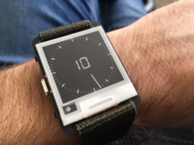

# Line watchface for Watchy GSR




A port of the [Line](https://github.com/mistablinky/Line-for-Watchy) watchface first made by mistablinky for the original Watchy firmware to [Watchy GSR](https://github.com/gurusr/Watchy_GSR).

## Adding to a Watchy GSR build
1. Add this repo as a submodule in a Watchy GSR repo:
```sh
git submodule add https://github.com/win8linux/WatchyGSR_Addon_LineWatchy.git "Watchface Addons/Line"
```
2. Add the following include to `src/GSR.ino` in Watchy GSR:
```cpp
#include "../Watchface Addons/Line/LineWatchy.h"
```
3. Compile!
